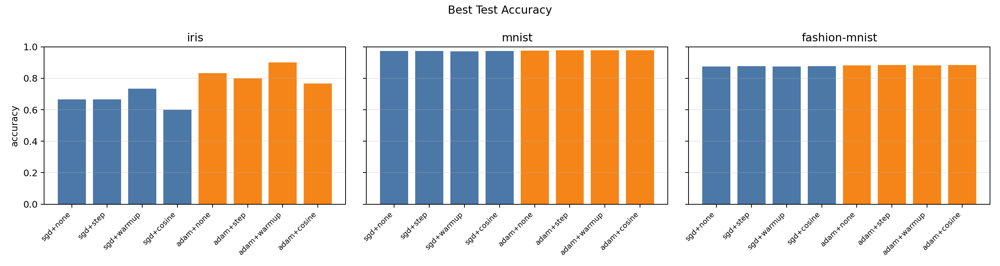
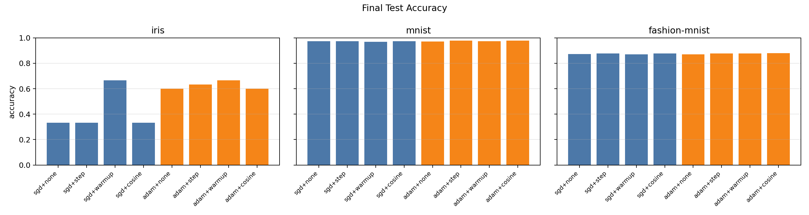
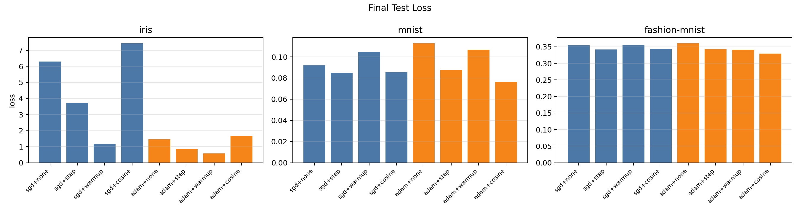
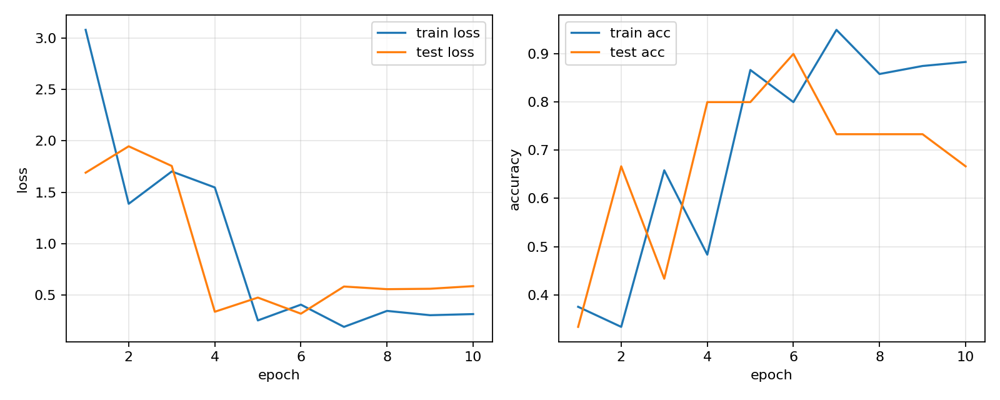
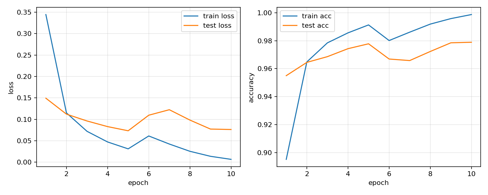
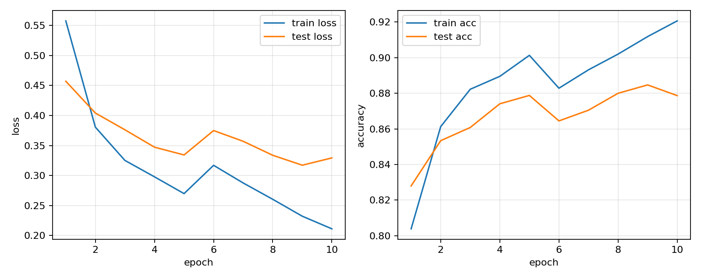

<center><b><font size=5> 神经网络课程大作业 实验报告 </font></b></center>

<center> 寇裕林 241220001 </center>


****


### 目录

一、实验内容简介（要求：简要介绍一下我们这次的大作业内容，简要介绍一下实验计划）

二、代码实现过程

​	2.1 实现张量算子（`./python/needle/ops/`）（要求：对于每个算子，在行内先用数学公式给出定义，再简要介绍一下实现的代码）

​	2.2 实现自动微分系统（`./python/needle/autograd.py`）（要求：讲一下计算图拓扑，再讲反向传播算法的数学公式和代码实现）

​	2.3 实现神经网络初始化算法（`./python/needle/init/`）（要求：对于每个初始化算法，先用数学公式给出定义，再简要介绍一下实现的代码）

​	2.4 实现神经网络模块 Modules（`./python/needle/nn/`）（要求：对于每一个模块，先简单讲一下用处和公式，再简单讲一下代码实现）

​	2.5 实现优化器 Optimizers（`./python/needle/optim.py`）（要求：对于两个优化器 SGD 和 Adam，先讲一下公式，再简单讲一下代码实现、接口和用法）

​	2.6 实现调度器 Schedulers（`./python/needle/optim.py`）（要求：先简单说明一下为什么要调度器，再对于每种调度器，讲一下原理和好处，再简单讲一下代码实现）

​	2.7 实现数据加载器 DataLoader（`./python/needle/data/`）（要求：先简单说明一下 dataloader 的作用，再简短介绍一下作业中用到的数据集的数据格式，讲一下代码实现思路）

三、实验部分

​	3.1 ResidualMLP 实验（`./apps/`, `./checkpoints/`）（要求：按顺序讲以下几个部分：1. ResidualMLP 的模型架构；2. train_residual_mlp 脚本的实现思路；3. 做了哪几组系统实验、每一组的配置是什么；4. 分析一下实验数据得到结果）


****


### 一、实验内容简介

本次大作业的目标是实现一个小型神经网络编程框架。这个框架需要覆盖从张量计算、自动微分、神经网络模块搭建，到优化器、学习率调度、数据加载和模型实验的完整训练流程。与直接调用 PyTorch 等成熟框架不同，本实验要求我们在项目给出的代码骨架上逐步补全底层功能，使模型训练过程真正建立在自己实现的 `Tensor`、`Op`、`Module`、`Optimizer` 和 `DataLoader` 之上。

从功能上看，整个实验可以分为两个层次。第一层是框架层，实现神经网络训练所需的基础能力，包括基础张量算子、反向传播算法、参数初始化、神经网络层、损失函数、优化器、学习率调度器和数据加载器。第二层是应用层，使用该框架构造 ResidualMLP 模型，并在 Iris、MNIST 和 Fashion-MNIST 三个数据集上进行系统实验，比较不同优化器和学习率调度策略对训练结果的影响。

本实验的整体计划如下。首先补齐张量算子和自动微分，使框架能够完成前向计算和反向传播；然后实现初始化方法、基础网络模块和损失函数，使模型能够以模块化方式搭建；接着实现 SGD、Adam 和学习率调度器，使参数更新过程完整可控；随后实现数据读取、批量加载和数据预处理脚本；最后实现 ResidualMLP 模型和训练脚本，进行多组系统实验并记录结果。除此之外，后续为了扩展 ResNet9 实验，还补充实现了 `nn.Conv` 和 Transformer 相关模块，不过本报告的系统实验主要围绕 ResidualMLP 展开。

### 二、代码实现过程

#### 2.1 实现张量算子（`./python/needle/ops/`）

张量算子是整个框架的底层计算基础。每个算子都需要实现两个部分：一是 `compute`，负责前向计算；二是 `gradient`，负责根据上游梯度计算输入节点的梯度。代码主要位于 `python/needle/ops/ops_mathematic.py` 和 `python/needle/ops/ops_logarithmic.py`。

**逐元素加法 `EWiseAdd` 与标量加法 `AddScalar`。** 定义为 $z=x+y$ 和 $z=x+c$。加法对两个输入的局部导数均为 1，因此反向传播时两个输入都接收同一个上游梯度：$\partial L/\partial x=\bar z$，$\partial L/\partial y=\bar z$。代码中 `EWiseAdd.gradient` 直接返回 `(out_grad, out_grad)`，标量加法只对张量输入求梯度。

**逐元素乘法 `EWiseMul` 与标量乘法 `MulScalar`。** 定义为 $z=xy$ 和 $z=cx$。逐元素乘法的梯度为 $\partial L/\partial x=\bar z\cdot y$，$\partial L/\partial y=\bar z\cdot x$；标量乘法的梯度为 $\partial L/\partial x=c\bar z$。实现时复用已有张量乘法即可。

**幂运算 `EWisePow` 与 `PowerScalar`。** 定义为 $z=x^y$ 和 $z=x^c$。标量幂的梯度为 $\partial L/\partial x=\bar z\cdot c x^{c-1}$。逐元素幂的完整梯度为 $\partial z/\partial x=yx^{y-1}$，$\partial z/\partial y=x^y\log x$。实现中还修正了原始骨架里对输入类型判断不正确的问题，使其基于计算图中的 `Tensor` 节点求导。

**除法 `EWiseDiv` 与 `DivScalar`。** 定义为 $z=x/y$ 和 $z=x/c$。梯度为 $\partial L/\partial x=\bar z/y$，$\partial L/\partial y=-\bar z x/y^2$，标量除法为 $\partial L/\partial x=\bar z/c$。代码中使用已有乘法、幂和除法组合表达梯度公式。

**取负 `Negate`。** 定义为 $z=-x$。梯度为 $\partial L/\partial x=-\bar z$。该算子虽然简单，但它是减法、二元损失等表达式的重要基础。

**对数 `Log`、指数 `Exp` 和双曲正切 `Tanh`。** 分别定义为 $z=\log x$、$z=e^x$、$z=\tanh x$。对应梯度为 $\bar z/x$、$\bar z e^x$、$\bar z(1-\tanh^2 x)$。这些算子用于 softmax、交叉熵、激活函数和归一化计算。

**ReLU。** 定义为 $\mathrm{ReLU}(x)=\max(x,0)$。其梯度为 $1_{x>0}\bar z$。实现中通过输入的 `cached_data` 构造布尔 mask，再将 mask 转为不需要梯度的 `Tensor`，最后与上游梯度相乘。

**转置 `Transpose`。** 定义为交换张量的两个轴。若前向为 $z=\mathrm{transpose}(x)$，反向只需对上游梯度执行逆置换。对于只交换两个轴的情况，逆操作仍是交换同样的两个轴。代码同时处理未指定轴时默认交换最后两个维度的情况。

**变形 `Reshape`。** 定义为改变张量形状但不改变元素顺序。反向传播时只需要把上游梯度 reshape 回输入原形状。该算子广泛用于 Flatten、BatchNorm、Transformer 多头拆分等场景。

**广播 `BroadcastTo`。** 定义为把较小形状的张量扩展为目标形状。反向传播时需要把被广播出来的维度求和压回原输入形状。实现中编写了 `_sum_to_shape` 辅助函数，用于处理前置维度补齐和大小为 1 的维度规约。

**求和 `Summation`。** 定义为 $z=\sum_{i\in axes}x$。反向传播时，上游梯度需要先 reshape 成保留被规约维度的形状，再 broadcast 回输入形状。例如对 `(m,n)` 按列求和得到 `(m,)`，反向时要先变成 `(m,1)`，再扩展为 `(m,n)`。

**矩阵乘法 `MatMul`。** 定义为 $C=AB$。二维情况下梯度公式为 $\partial L/\partial A=\bar C B^T$，$\partial L/\partial B=A^T\bar C$。由于高维 batched matmul 可能引入广播，代码在求出梯度后使用 `_sum_to_shape` 规约回原输入形状。

**索引、拼接与拆分 `TensorGetItem`、`Stack`、`Split`。** 索引用于从张量中取局部区域，反向时将梯度放回原位置，其余位置为 0。`Stack` 把多个张量沿新轴拼接，反向时使用 `Split` 拆开；`Split` 的反向则是重新 `Stack`。这些算子为序列模型和复杂网络结构提供了更灵活的张量组织能力。

**翻转、膨胀与反膨胀 `Flip`、`Dilate`、`UnDilate`。** 翻转定义为沿指定轴反转元素顺序，反向仍然是相同轴的翻转。膨胀是在指定轴之间插入 0，反膨胀则按步长取回元素。这些算子主要服务于卷积反向传播。

**卷积算子 `Conv`。** 底层卷积算子接受 NHWC 输入和 `(K,K,C_in,C_out)` 卷积核。前向使用 `as_strided` 将局部感受野展开为矩阵，再通过矩阵乘法得到输出。反向传播根据卷积的梯度公式实现：输入梯度使用翻转后的卷积核与上游梯度卷积，权重梯度通过输入与上游梯度卷积得到。该底层算子后续由 `nn.Conv` 封装为 NCHW 接口。

**LogSoftmax 与 LogSumExp。** `LogSumExp` 定义为 $\log\sum_i e^{x_i}$，实现时使用数值稳定形式：

```python
max_z = max(Z)
logsumexp = max_z + log(sum(exp(Z - max_z)))
```

其梯度为 softmax 权重：$\partial \mathrm{logsumexp}(x)/\partial x_i=\exp(x_i-\mathrm{logsumexp}(x))$。`LogSoftmax` 定义为 $x-\mathrm{logsumexp}(x)$，其梯度为 $\bar y-\mathrm{softmax}(x)\sum_i\bar y_i$。代码中还处理了 `axes=None`、负轴、多轴规约等情况。

#### 2.2 实现自动微分系统（`./python/needle/autograd.py`）

自动微分系统的核心是计算图。每个由算子产生的 `Tensor` 节点都会记录自己的 `op` 和 `inputs`，叶子节点则没有 `op`。前向计算构造出一个有向无环图，边表示张量之间的依赖关系。反向传播时，需要从输出节点出发，沿计算图反向把梯度传回每个输入节点。

本实验实现了两个关键函数：`find_topo_sort` 和 `compute_gradient_of_variables`。拓扑排序函数从输出节点开始，对其输入节点做深度优先搜索。遍历时先访问输入，再把当前节点加入列表，因此得到的顺序满足“输入节点一定排在使用它的节点之前”。反向传播时只需要反转这个拓扑序，即可从输出向输入逐层传播梯度。

反向传播的数学基础是链式法则。若节点 $v_i$ 对最终输出 $L$ 的伴随值记为 $\bar v_i=\partial L/\partial v_i$，并且某个节点 $v_j$ 由操作 $f_j$ 产生，即 $v_j=f_j(v_{j_1},...,v_{j_k})$，那么对输入节点的梯度贡献为：

$$
\bar v_{j_m} \mathrel{+}= \bar v_j \frac{\partial f_j}{\partial v_{j_m}}
$$

由于一个中间节点可能被多个后续节点使用，所以它会收到多份梯度贡献。代码中使用字典 `node_to_output_grads_list` 保存每个节点收到的所有梯度列表，遍历到该节点时先把列表中的梯度求和，再调用当前节点对应算子的 `gradient_as_tuple` 继续向输入传播。核心逻辑可以概括为：

```python
node.grad = sum_node_list(node_to_output_grads_list[node])
for input_node, grad in zip(node.inputs, node.op.gradient_as_tuple(node.grad, node)):
    node_to_output_grads_list[input_node].append(grad)
```

这样实现后，只要每个算子正确提供局部梯度，整个计算图就可以自动完成从 loss 到所有参数的反向传播。后续优化器只需要读取每个 `Parameter` 的 `grad` 字段，即可更新模型参数。

#### 2.3 实现神经网络初始化算法（`./python/needle/init/`）

初始化方法的目标是使神经网络在训练初期保持稳定的激活方差和梯度方差。如果权重过大，激活和梯度容易爆炸；如果权重过小，信号又容易消失。本实验实现了 Xavier 和 Kaiming/He 两类初始化方法，代码位于 `python/needle/init/init_initializers.py`。

**Xavier Uniform。** 适合 Sigmoid、Tanh 等相对平滑的激活函数。定义为：

$$
W\sim U(-a,a), \quad a=gain\sqrt{\frac{6}{fan\_in+fan\_out}}
$$

代码中先根据 `fan_in` 和 `fan_out` 计算边界 `bound`，再调用 `init.rand` 在 `[-bound,bound]` 之间采样。

**Xavier Normal。** 正态分布版本定义为：

$$
W\sim N(0,\sigma^2), \quad \sigma=gain\sqrt{\frac{2}{fan\_in+fan\_out}}
$$

实现上调用 `init.randn` 并传入对应标准差。

**Kaiming Uniform。** 主要用于 ReLU 网络。ReLU 会截断约一半输入，因此初始化需要补偿这一方差变化。均匀分布形式为：

$$
W\sim U(-a,a), \quad a=\sqrt{\frac{6}{fan\_in}}
$$

代码中默认 `nonlinearity="relu"`，并支持传入自定义 `shape`，因此既可用于线性层，也可用于卷积核。

**Kaiming Normal。** 正态分布形式为：

$$
W\sim N(0,\sigma^2), \quad \sigma=\sqrt{\frac{2}{fan\_in}}
$$

在 `Linear` 层和 `Conv` 层中，权重初始化都主要采用 Kaiming 方法，以匹配实验中大量使用的 ReLU 激活。

#### 2.4 实现神经网络模块 Modules（`./python/needle/nn/`）

神经网络模块位于 `python/needle/nn/`。模块系统的核心是 `Module` 和 `Parameter`。`Parameter` 继承自 `Tensor`，表示需要训练的参数；`Module.parameters()` 会递归收集当前模块及其子模块中的所有 `Parameter`。这样优化器可以直接接收 `model.parameters()`，而不需要手动维护每个权重。

**Linear。** 全连接层定义为 $Y=XW+b$。权重形状为 `(in_features,out_features)`，偏置形状为 `(1,out_features)`。前向中先做矩阵乘法，再将 bias broadcast 到输出形状。该模块是 ResidualMLP 的主要组成部分。

**Flatten。** 将输入除 batch 维以外的所有维度展平，即把 `(N,d_1,...,d_k)` 变成 `(N,d_1...d_k)`。它常用于图像进入全连接层之前。

**ReLU、Sigmoid、Softmax。** ReLU 直接调用底层 `ops.relu`。Sigmoid 使用 $\sigma(x)=1/(1+e^{-x})$。Softmax 通过稳定的 `logsoftmax` 实现，即 $\mathrm{softmax}(x)=\exp(\mathrm{logsoftmax}(x))$。

**Sequential。** 顺序容器用于按顺序组织多个子模块。其逻辑很简单：依次把输入传给内部模块，最后返回输出。ResidualMLP 的整体网络就是通过 `Sequential` 组合出来的。

**SoftmaxLoss。** 多分类交叉熵损失。对于 logits $Z$ 和类别标签 $y$，每个样本的损失为：

$$
\ell = \log\sum_j e^{Z_j} - Z_y
$$

实现时先把类别标签转为 one-hot，再用 `logsumexp` 减去正确类别的 logit，最后对 batch 求平均。该写法避免了显式计算 softmax 后再取 log，数值上更稳定。

**CrossEntropyLoss 与 BinaryCrossEntropyLoss。** 前者用于标签已经是 one-hot 或概率分布的多分类任务，公式为 $-\sum_i y_i\log p_i$；后者用于二分类概率输入，公式为 $-[y\log p+(1-y)\log(1-p)]$。实现中加入很小的 `eps`，避免 `log(0)`。

**MSELoss。** 均方误差损失，定义为 $\mathrm{mean}((x-y)^2)$。它主要用于回归任务或简单数值测试。

**BatchNorm1d 与 BatchNorm2d。** BatchNorm1d 对 `(N,D)` 输入按特征维计算均值和方差：

$$
\hat x=\frac{x-\mu}{\sqrt{\sigma^2+\epsilon}},\quad y=\gamma\hat x+\beta
$$

训练阶段使用 batch 统计量，并更新 `running_mean` 和 `running_var`；测试阶段使用运行统计量。BatchNorm2d 继承 BatchNorm1d，通过转置和 reshape 将 `(N,C,H,W)` 变成 `(N H W,C)` 后做归一化，再恢复原形状。

**LayerNorm1d。** LayerNorm 对每个样本的最后一维做归一化，不依赖 batch 统计量。它更适合 Transformer 等序列模型。实现中使用 `_mean_keepdims` 保持维度，方便后续 broadcast。

**Dropout。** 训练阶段以概率 `p` 将部分元素置零，并用 $1/(1-p)$ 缩放剩余元素，使输出期望保持不变。测试阶段直接返回输入。

**Residual。** 残差连接定义为 $y=f(x)+x$。它允许网络学习残差映射，缓解深层网络训练困难。ResidualMLPBlock 中使用的就是这个模块。

**Conv。** `nn.Conv` 是对底层 `ops.conv` 的模块封装。模块外部接受 NCHW 输入 `(N,C,H,W)`，内部转为底层算子使用的 NHWC，卷积后再转回 NCHW。权重形状为 `(K,K,C_in,C_out)`，并支持 bias。该模块为后续 ResNet9 实验做准备。

**Transformer 相关模块。** 后续扩展中补充了 `Embedding`、`MultiHeadAttention`、`AttentionLayer`、`TransformerLayer` 和 `Transformer`。多头注意力的核心公式为：

$$
\mathrm{Attention}(Q,K,V)=\mathrm{softmax}\left(\frac{QK^T}{\sqrt{d}}\right)V
$$

实现中支持 causal mask、dropout、LayerNorm、残差连接和前馈网络。虽然这些模块不直接参与 ResidualMLP 系统实验，但它们完善了 `nn` 模块的扩展能力。

#### 2.5 实现优化器 Optimizers（`./python/needle/optim.py`）

优化器负责根据参数梯度更新模型参数。本实验实现了 SGD 和 Adam，并在优化器状态和参数写回时使用 `detach()`，避免优化器内部状态被错误接入计算图。

**Optimizer 基类。** 基类保存参数列表，并提供 `reset_grad()` 清空所有参数梯度。一次训练迭代的标准流程为：

```python
loss.backward()
optimizer.step()
optimizer.reset_grad()
```

**SGD。** 普通随机梯度下降公式为：

$$
\theta_{t+1}=\theta_t-\eta g_t
$$

如果加入 weight decay，则先修正梯度：

$$
g_t \leftarrow g_t+\lambda\theta_t
$$

如果加入 momentum，则使用速度缓存：

$$
u_t=\mu u_{t-1}+g_t,\quad \theta_{t+1}=\theta_t-\eta u_t
$$

代码中用字典 `self.u[param]` 为每个参数保存动量状态。`clip_grad_norm` 会先计算所有梯度的全局 L2 范数，若超过阈值，则按同一比例缩放所有梯度，以缓解梯度爆炸。

**Adam。** Adam 同时维护梯度的一阶矩和二阶矩：

$$
m_t=\beta_1m_{t-1}+(1-\beta_1)g_t
$$

$$
v_t=\beta_2v_{t-1}+(1-\beta_2)g_t^2
$$

由于初始值为 0，需要做偏差修正：

$$
\hat m_t=\frac{m_t}{1-\beta_1^t},\quad \hat v_t=\frac{v_t}{1-\beta_2^t}
$$

最终更新为：

$$
\theta_{t+1}=\theta_t-\eta\frac{\hat m_t}{\sqrt{\hat v_t}+\epsilon}
$$

Adam 的优点是能根据历史梯度自适应调整不同参数的更新幅度，因此在本实验的 MNIST、Fashion-MNIST 和 Iris 上整体表现更稳定。

#### 2.6 实现调度器 Schedulers（`./python/needle/optim.py`）

学习率调度器用于在训练过程中动态修改 `optimizer.lr`。固定学习率虽然简单，但在训练初期和后期的需求不同：初期可能需要较大学习率快速下降，后期则需要较小学习率稳定收敛。因此本实验在 `optim.py` 中实现了 `LRScheduler` 基类和三种具体调度器。

**LRScheduler。** 基类保存 `optimizer`、`base_lr` 和 `last_epoch`。每次调用 `step()` 时，先更新计数器，再调用子类 `get_lr()` 计算新学习率，并写回 `optimizer.lr`。训练脚本在每个 epoch 开始时调用 `scheduler.step()`，使本轮训练实际使用日志中记录的学习率。

**StepDecay。** 阶梯衰减的公式为：

$$
lr=base\_lr\cdot \gamma^{\lfloor t/step\_size\rfloor}
$$

它的好处是实现简单、效果稳定，适合在若干 epoch 后降低学习率，使模型在后期更细致地搜索参数空间。

**LinearWarmUp。** 线性预热从较小学习率逐步增加到基础学习率：

$$
lr=start\_lr+(base\_lr-start\_lr)\frac{t+1}{warmup\_steps}
$$

训练初期如果学习率过大，模型可能出现震荡；warmup 可以让更新幅度逐渐增大，特别适合不稳定的小数据集或较深模型。

**CosineDecayWithWarmRestarts。** 余弦退火带重启的公式为：

$$
lr=min\_lr+(base\_lr-min\_lr)\frac{1+\cos(\pi t/T)}{2}
$$

每个周期内学习率从 `base_lr` 平滑下降到接近 `min_lr`，周期结束后重新回到较大学习率。它的好处是既能平滑衰减，又能通过重启帮助模型跳出较差区域。本实验中，cosine 在 MNIST 和 Fashion-MNIST 上取得了最好的结果。

#### 2.7 实现数据加载器 DataLoader（`./python/needle/data/`）

DataLoader 的作用是把数据集按 mini-batch 形式送入训练过程。它需要处理样本顺序、batch 切分、shuffle、数据增强和 Tensor 转换等问题。没有 DataLoader 时，训练脚本需要手动维护索引和 batch；有了 DataLoader 后，训练循环只需写：

```python
for x, y in dataloader:
    logits = model(x)
```

本实验实现了 `Dataset` 抽象类和 `DataLoader`。`DataLoader.__iter__` 每个 epoch 重新生成样本顺序；如果 `shuffle=True`，使用 `np.random.permutation` 打乱索引。`__next__` 取出当前 batch 的下标，优先尝试批量索引 `dataset[batch_indices]`。如果数据集带有 transform，则逐样本读取，确保随机翻转、随机裁剪等增强可以对每个样本独立生效。最后通过递归函数把 numpy 数组转换成 `needle.Tensor`。

本实验用到三个数据集。Iris 是表格数据，每个样本有 4 个连续特征和 1 个类别标签，预处理后训练集为 `(120,4)`，测试集为 `(30,4)`。MNIST 和 Fashion-MNIST 是 IDX gzip 格式图像数据，图像为 28×28 灰度图，解析后展平为 `(N,784)`，像素值归一化到 `[0,1]`，标签为 `0-9`。数据解析位于 `mnist_dataset.py`，Iris 数据读取位于 `iris_dataset.py`，本地数据预处理脚本位于 `data/prepare_data.py`。

此外，还实现了 `RandomFlipHorizontal` 和 `RandomCrop` 两个基础图像 transform，为后续图像实验提供支持。

### 三、实验部分

#### 3.1 ResidualMLP 实验（`./python/apps`）

**1. ResidualMLP 模型架构。** 本实验的主要模型是 `ResidualMLP`，代码位于 `apps/residual_mlp.py`。该模型面向表格数据和展平后的图像数据。Iris 输入维度为 4，MNIST 和 Fashion-MNIST 输入维度为 784。模型首先用一个线性层将输入映射到隐藏维度，然后堆叠若干残差 MLP 块，最后通过线性层输出类别 logits。

整体结构为：

```text
Linear(input_dim, hidden_dim) -> ReLU
-> ResidualMLPBlock * num_blocks
-> Linear(hidden_dim, num_classes)
```

每个残差块的形式为：

$$
block(x)=\mathrm{ReLU}(x+W_2\mathrm{ReLU}(W_1x))
$$

代码中对应 `ResidualMLPBlock`，内部使用 `nn.Residual(nn.Sequential(Linear, ReLU, Linear))`，再接一个 ReLU。残差连接要求输入和输出维度一致，因此残差块内部均为 `hidden_dim -> hidden_dim` 的线性层。`ResidualMLP.forward` 还会自动处理高维输入，如果输入形状超过二维，则先展平成 `(batch,input_dim)`。

**2. train_residual_mlp 脚本实现思路。** 训练脚本位于 `apps/train_residual_mlp.py`。脚本首先根据 `--dataset` 构造对应 Dataset 和 DataLoader，然后根据数据集信息确定输入维度和类别数，构造 ResidualMLP、损失函数、优化器和 scheduler。核心训练函数 `run_epoch` 同时支持训练和测试：训练时调用 `loss.backward()`、`optimizer.step()` 和 `optimizer.reset_grad()`；测试时只做前向计算和指标统计。

脚本还实现了完整实验管理功能。每组实验会自动创建目录：

```text
checkpoints/ResidualMLP__<dataset>__<optimizer>__<scheduler>__<model>/
```

其中保存 `config.json`、`metrics.csv`、`summary.json`、`curves.png` 和 `model.npz`。`metrics.csv` 记录每个 epoch 的训练/测试 loss、accuracy 和学习率；`summary.json` 保存最终结果和最佳测试准确率；`curves.png` 保存训练曲线。脚本还支持 `tqdm` 进度条，并提供 `--no-progress` 用于关闭进度条。

**3. 系统实验配置。** 本次系统实验固定模型结构和训练基本参数：

```text
hidden_dim = 128
num_blocks = 2
epochs = 10
batch_size = 256
seed = 42
```

变化的实验因素包括三个数据集、两个优化器和四种 scheduler：

```text
数据集：Iris, MNIST, Fashion-MNIST
优化器：SGD, Adam
Scheduler：none, step, warmup, cosine
```

因此共有 24 组实验。SGD 使用学习率 0.01，Adam 使用学习率 0.001；step 使用 `step_size=5, gamma=0.5`；warmup 使用 `warmup_steps=3, start_lr=0.0`；cosine 使用 `first_cycle_steps=5, min_lr=0.0001`。完整命令记录在 `apps/residual_mlp_experiments.txt`，批量运行脚本为 `apps/train_residual_mlp.sh`。

| 编号 | 数据集 | 优化器 | Scheduler | 学习率 | Scheduler 参数 |
|---:|---|---|---|---:|---|
| 1 | Iris | SGD | none | 0.01 | - |
| 2 | Iris | SGD | step | 0.01 | step_size=5, gamma=0.5 |
| 3 | Iris | SGD | warmup | 0.01 | warmup_steps=3, start_lr=0.0 |
| 4 | Iris | SGD | cosine | 0.01 | first_cycle_steps=5, min_lr=0.0001 |
| 5 | Iris | Adam | none | 0.001 | - |
| 6 | Iris | Adam | step | 0.001 | step_size=5, gamma=0.5 |
| 7 | Iris | Adam | warmup | 0.001 | warmup_steps=3, start_lr=0.0 |
| 8 | Iris | Adam | cosine | 0.001 | first_cycle_steps=5, min_lr=0.0001 |
| 9 | MNIST | SGD | none | 0.01 | - |
| 10 | MNIST | SGD | step | 0.01 | step_size=5, gamma=0.5 |
| 11 | MNIST | SGD | warmup | 0.01 | warmup_steps=3, start_lr=0.0 |
| 12 | MNIST | SGD | cosine | 0.01 | first_cycle_steps=5, min_lr=0.0001 |
| 13 | MNIST | Adam | none | 0.001 | - |
| 14 | MNIST | Adam | step | 0.001 | step_size=5, gamma=0.5 |
| 15 | MNIST | Adam | warmup | 0.001 | warmup_steps=3, start_lr=0.0 |
| 16 | MNIST | Adam | cosine | 0.001 | first_cycle_steps=5, min_lr=0.0001 |
| 17 | Fashion-MNIST | SGD | none | 0.01 | - |
| 18 | Fashion-MNIST | SGD | step | 0.01 | step_size=5, gamma=0.5 |
| 19 | Fashion-MNIST | SGD | warmup | 0.01 | warmup_steps=3, start_lr=0.0 |
| 20 | Fashion-MNIST | SGD | cosine | 0.01 | first_cycle_steps=5, min_lr=0.0001 |
| 21 | Fashion-MNIST | Adam | none | 0.001 | - |
| 22 | Fashion-MNIST | Adam | step | 0.001 | step_size=5, gamma=0.5 |
| 23 | Fashion-MNIST | Adam | warmup | 0.001 | warmup_steps=3, start_lr=0.0 |
| 24 | Fashion-MNIST | Adam | cosine | 0.001 | first_cycle_steps=5, min_lr=0.0001 |

**4. 实验结果。** 本次 24 组实验均成功完成，每组实验目录中均保存了配置、逐 epoch 指标、曲线图和模型参数。结果如下表所示，其中 `Best Test Acc` 表示 10 个 epoch 中最高测试准确率。

| 数据集 | 优化器 | Scheduler | Final Test Acc | Best Test Acc | Best Epoch | Final Test Loss |
|---|---|---|---:|---:|---:|---:|
| Fashion-MNIST | Adam | cosine | 0.8787 | 0.8847 | 9 | 0.3292 |
| Fashion-MNIST | Adam | none | 0.8711 | 0.8809 | 7 | 0.3605 |
| Fashion-MNIST | Adam | step | 0.8767 | 0.8836 | 8 | 0.3422 |
| Fashion-MNIST | Adam | warmup | 0.8781 | 0.8811 | 8 | 0.3413 |
| Fashion-MNIST | SGD | cosine | 0.8760 | 0.8762 | 9 | 0.3440 |
| Fashion-MNIST | SGD | none | 0.8729 | 0.8749 | 9 | 0.3542 |
| Fashion-MNIST | SGD | step | 0.8779 | 0.8779 | 10 | 0.3414 |
| Fashion-MNIST | SGD | warmup | 0.8694 | 0.8755 | 9 | 0.3550 |
| Iris | Adam | cosine | 0.6000 | 0.7667 | 6 | 1.6603 |
| Iris | Adam | none | 0.6000 | 0.8333 | 8 | 1.4667 |
| Iris | Adam | step | 0.6333 | 0.8000 | 9 | 0.8634 |
| Iris | Adam | warmup | 0.6667 | 0.9000 | 6 | 0.5860 |
| Iris | SGD | cosine | 0.3333 | 0.6000 | 6 | 7.4379 |
| Iris | SGD | none | 0.3333 | 0.6667 | 8 | 6.3045 |
| Iris | SGD | step | 0.3333 | 0.6667 | 9 | 3.7145 |
| Iris | SGD | warmup | 0.6667 | 0.7333 | 8 | 1.1612 |
| MNIST | Adam | cosine | 0.9789 | 0.9789 | 10 | 0.0764 |
| MNIST | Adam | none | 0.9710 | 0.9761 | 8 | 0.1128 |
| MNIST | Adam | step | 0.9776 | 0.9784 | 7 | 0.0875 |
| MNIST | Adam | warmup | 0.9732 | 0.9769 | 9 | 0.1066 |
| MNIST | SGD | cosine | 0.9736 | 0.9736 | 10 | 0.0856 |
| MNIST | SGD | none | 0.9723 | 0.9723 | 10 | 0.0918 |
| MNIST | SGD | step | 0.9741 | 0.9741 | 10 | 0.0849 |
| MNIST | SGD | warmup | 0.9680 | 0.9710 | 9 | 0.1047 |

系统实验的汇总图如下。







三个数据集最佳配置的训练曲线如下。







**5. 实验结果分析。** 从整体结果看，ResidualMLP 在 MNIST 上表现最好，最佳测试准确率达到 0.9789；在 Fashion-MNIST 上最佳测试准确率为 0.8847；在 Iris 上最佳测试准确率为 0.9000。MNIST 是相对规则的灰度手写数字数据，展平输入后 MLP 仍然能够学习到较好的分类边界，因此准确率最高。Fashion-MNIST 的类别外观更复杂，同样使用展平输入时无法充分利用图像局部结构，因此准确率低于 MNIST。Iris 数据集很小，测试集只有 30 个样本，每错一个样本准确率就变化约 3.33%，因此测试准确率波动明显。

从优化器角度看，Adam 整体优于 SGD，尤其在 Iris 上更稳定。MNIST 中 `Adam + cosine` 达到 0.9789，`Adam + step` 也达到 0.9784，二者非常接近；SGD 最好结果为 `SGD + step` 的 0.9741。Fashion-MNIST 中 Adam 的四种 scheduler 都在 0.88 左右，整体略优于 SGD。Iris 中 Adam 的最佳结果为 `Adam + warmup` 的 0.9000，而多个 SGD 配置最终准确率只有 0.3333，说明 SGD 在这个小数据集和当前学习率设置下较不稳定。

从 scheduler 角度看，cosine 在 MNIST 和 Fashion-MNIST 上最有优势，分别取得 0.9789 和 0.8847 的最佳结果。step 也比较稳定，在 MNIST 和 Fashion-MNIST 上都接近最优。warmup 对 Iris 帮助最大，说明小数据集训练初期适当减小学习率有助于避免不稳定更新。固定学习率 none 在 MNIST 和 Fashion-MNIST 上也能得到不错结果，但通常不是最优配置。

综合本次实验，推荐配置如下：

| 数据集 | 推荐配置 | Best Test Acc |
|---|---|---:|
| Iris | Adam + warmup | 0.9000 |
| MNIST | Adam + cosine | 0.9789 |
| Fashion-MNIST | Adam + cosine | 0.8847 |

通过这些实验可以看到，本次实现的框架已经能够支持从数据加载、模型定义、自动微分、参数更新到实验记录的完整神经网络训练流程。ResidualMLP 在三个数据集上的结果也符合数据集难度和模型结构特点，说明框架实现基本正确，实验结果具有合理性。

